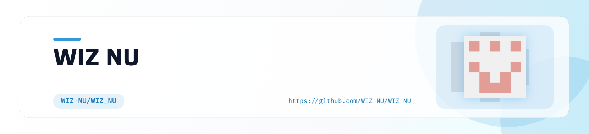

# Hey there, I'm **VISHNU S** 👋

<picture>
  <source media="(prefers-color-scheme: dark)" srcset="art/header-dark.png">
  
</picture>

 

---

# 💖 About Me

<table>
<tr>
<td width="65%">

- 🌸 Flutter Developer
- 🤖 AI Enthusiast
- 💻 Full Stack Learner
- 🚀 Building AI-powered apps
- 🌱 Currently learning AI & Full Stack
- ⚡ Fun fact: Ask doubts 😄

</td>
<td width="35%" align="center">

</td>
</tr>
</table>

---

# 💻 Tech Stack

---

# 📊 GitHub Analytics

---

# 🔥 GitHub Streak

---

# 📈 Activity Graph

---

# 🐍 Contribution Snake

<!-- Configure the Platane/snk GitHub Action -->
<picture>
<source media="(prefers-color-scheme: dark)" srcset="https://raw.githubusercontent.com/WIZ_NU/WIZ_NU/output/github-contribution-grid-snake-dark.svg">

</picture>

---

# 🌐 Connect With Me

---

### 💖 Thanks for visiting my profile!

*Code. Learn. Build. Repeat.*

